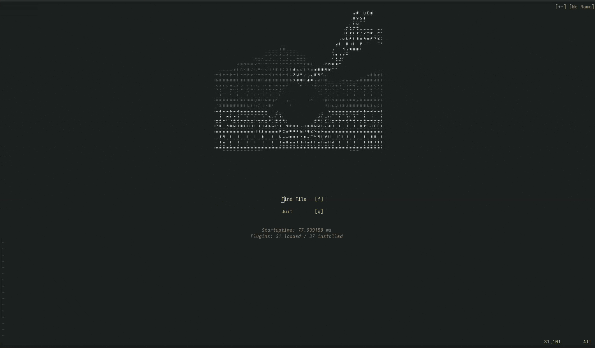

# milli.nvim

Animated ASCII splash screens for Neovim. Ships with 24 bundled splashes, live procedural shaders (matrix rain, plasma, DOOM fire, starfield — computed in pure Lua, no frames on disk), and a community registry: `:MilliInstall <name>` pulls new splashes without leaving the editor. Bring your own from any image, GIF, or plain text via the milli CLI. Works with dashboard-nvim, alpha-nvim, snacks.nvim, mini.starter, or raw `VimEnter`.



## Contents

- [Bundled splashes](#bundled-splashes)
- [Install](#install)
- [Quick start](#quick-start)
- [Live shaders](#live-shaders) ← infinite, zero-asset animations
- [Community registry](#community-registry) ← `:MilliInstall`
- [Using your own splash](#using-your-own-splash) ← bring any image, GIF, or text
- [Dashboard integrations](#dashboard-integrations)
  - [dashboard-nvim](#dashboard-nvim)
  - [alpha-nvim](#alpha-nvim)
  - [snacks.nvim](#snacksnvim)
  - [mini.starter](#ministarter)
  - [No plugin (raw VimEnter)](#no-plugin-raw-vimenter)
- [Previewing](#previewing)
- [API](#api)
- [Requirements](#requirements)
- [License](#license)

## Bundled splashes

<table>
<tr>
<td align="center"><b>aiface</b><br></td>
<td align="center"><b>attackontitan</b><br></td>
<td align="center"><b>aurora</b><br></td>
</tr>
<tr>
<td align="center"><b>badge</b><br></td>
<td align="center"><b>blackhole</b><br></td>
<td align="center"><b>cactus</b><br></td>
</tr>
<tr>
<td align="center"><b>catwoman</b><br></td>
<td align="center"><b>chrome</b><br></td>
<td align="center"><b>dancer</b><br></td>
</tr>
<tr>
<td align="center"><b>dancerramp</b><br></td>
<td align="center"><b>finger</b><br></td>
<td align="center"><b>fire</b><br></td>
</tr>
<tr>
<td align="center"><b>flyingcat</b><br></td>
<td align="center"><b>flyingdragon</b><br></td>
<td align="center"><b>ididnot</b><br></td>
</tr>
<tr>
<td align="center"><b>lighningtornado</b><br></td>
<td align="center"><b>lights</b><br></td>
<td align="center"><b>retrocircle</b><br></td>
</tr>
<tr>
<td align="center"><b>robot</b><br></td>
<td align="center"><b>shader</b><br></td>
<td align="center"><b>shadertwo</b><br></td>
</tr>
<tr>
<td align="center"><b>skeleton</b><br></td>
<td align="center"><b>skullone</b><br></td>
<td align="center"><b>skullthree</b><br></td>
</tr>
<tr>
<td align="center"><b>skulltwo</b><br></td>
<td align="center"><b>spaceship</b><br></td>
<td align="center"><b>spinner</b><br></td>
</tr>
<tr>
<td align="center"><b>vibecat</b><br></td>
<td align="center"><b>vibecattwo</b><br></td>
<td></td>
</tr>
</table>

## Install

**lazy.nvim:**
```lua
{ "amansingh-afk/milli.nvim", lazy = false }
```

**packer.nvim:**
```lua
use "amansingh-afk/milli.nvim"
```

## Quick start

```lua
-- preview any bundled splash in a scratch buffer
:MilliPreview fire

-- or wire into your dashboard
require("milli").dashboard({ splash = "fire", loop = true })
```

List bundled splash names:
```lua
:lua print(vim.inspect(require("milli").list()))
```

For dashboard-nvim / alpha-nvim / snacks.nvim / mini.starter wiring, see [Dashboard integrations](#dashboard-integrations).

## Live shaders

Baked splashes are flipbooks. Shaders are the opposite: **pure-Lua procedural animation computed every frame** — no data files, never repeats, resizes to your window.

```vim
:MilliShader rain       " fullscreen matrix rain
:MilliShader plasma     " flowing color fields
:MilliShader doomfire   " the classic PSX fire
:MilliShader starfield  " warp speed
```

`q` or `<Esc>` dismisses. Or drive one programmatically:

```lua
-- paint a live shader into any buffer; returns a stop() function
local stop = require("milli").shader(buf, { shader = "rain" })

-- options
require("milli").shader(buf, {
  shader = "plasma",  -- rain | plasma | doomfire | starfield
  fps = 20,           -- default: per-shader (18-24)
  cols = 80,          -- default: window width
  rows = 24,          -- default: window height
  seed = 42,          -- rain/doomfire/starfield randomness
  hue = 0.8,          -- plasma base hue 0..1
})
```

Colors are quantized to a small fixed palette per shader, so they stay well under Neovim's highlight-group cap.

## Community registry

Install splashes shared by other users straight from Neovim — no plugin update, no manual file copying:

```vim
:MilliBrowse            " list what's in the registry
:MilliInstall doomfire  " download → validate → ready
:MilliPreview doomfire  " watch it
:MilliUninstall doomfire
```

Installed splashes land in `stdpath("data")/milli/splashes/` and behave exactly like bundled ones — same `splash = "name"` API, same tab-completion.

Safety: registry files must be pure data modules (the exact output of `milli export -t lua`). `:MilliInstall` loads each candidate in an **empty Lua environment** before saving — anything that calls a function, touches a global, or isn't plain frame data is rejected.

Want your splash in the registry? PR it to [milli-splashes](https://github.com/amansingh-afk/milli-splashes) — it's a `frames.lua` + one line of `index.json`. Requires `curl` on `$PATH`. Point `vim.g.milli_registry` at your own URL to self-host a private registry.

## Using your own splash

> Powered by [**milli**](https://github.com/Amansingh-afk/milli) - the ASCII engine behind this plugin. [⭐ Star it on GitHub](https://github.com/Amansingh-afk/milli) if you find it useful.

The 29 bundled splashes are a starting point. Bring any image or GIF you want - a custom logo, mascot, anything - and it becomes a splash in four steps.

**1. Install the CLI** ([@amansingh-afk/milli](https://www.npmjs.com/package/@amansingh-afk/milli)):

```bash
npm install -g @amansingh-afk/milli
```

**2. Generate `frames.lua` from any image / GIF — or from nothing:**

```bash
# from an image or GIF
milli export mycat.gif ./out -t lua -w 60 --no-bg

# from plain text — your name in flames, glitch, matrix reveal, 8 effects
milli text "NEOVIM" -e fire -o ./out -t lua
milli text "RICKY" -e matrix -o ./out -t lua

# from a shader — baked at a fixed size
milli shader plasma -w 70 -h 16 -o ./out -t lua
```

Useful flags:
- `-w 60` - width in columns; tune to taste
- `--no-bg` - drop background color (cleaner on dashboards)
- `-m braille` - braille mode for higher-detail line art (image exports)
- `-e <effect>` - text effects: `fire` `glitch` `wave` `matrix` `dissolve` `typewriter` `pulse` `rainbow`

**3. Copy `frames.lua` into your Neovim config:**

```bash
mkdir -p ~/.config/nvim/lua/milli/splashes
cp out/frames.lua ~/.config/nvim/lua/milli/splashes/mycat.lua
```

Neovim's runtimepath auto-discovers `~/.config/nvim/lua/`, so this file becomes a sibling to the plugin's bundled splashes - findable by the same machinery, tab-completable in `:MilliPreview`.

**4. Use it - same API as any bundled splash:**

```lua
require("milli").dashboard({ splash = "mycat", loop = true })
```

Preview it first:
```
:MilliPreview mycat
```

### Custom module path (advanced)

If you don't want to piggyback on the `milli.splashes` namespace (e.g. you organize splashes under a dotfiles module), drop the file anywhere on runtimepath and reference it by Lua module path:

```lua
-- ~/.config/nvim/lua/mydots/splashes/mycat.lua
require("milli").dashboard({ module = "mydots.splashes.mycat", loop = true })
```

Works with every preset - `splash = "name"` for bundled/user-local, `module = "path.to.mod"` for custom namespaces.

## Dashboard integrations

Pick your dashboard plugin. Each preset (`dashboard`, `alpha`, `snacks`, `starter`, `vimenter`) works identically with bundled or custom splashes.

### dashboard-nvim

```lua
return {
  "nvimdev/dashboard-nvim",
  event = "VimEnter",
  dependencies = { "amansingh-afk/milli.nvim" },
  opts = function()
    local splash = require("milli").load({ splash = "finger" })
    return {
      theme = "doom",
      config = {
        header = splash.frames[1],         -- seed header with frame 0
        center = {
          { icon = "  ", desc = "Find File", key = "f", action = "Telescope find_files" },
          { icon = "  ", desc = "Quit",      key = "q", action = "qa" },
        },
      },
    }
  end,
  config = function(_, opts)
    require("dashboard").setup(opts)
    require("milli").dashboard({ splash = "finger", loop = true })
  end,
}
```

### alpha-nvim

```lua
require("milli").alpha({ splash = "fire", loop = true })
```

### snacks.nvim

```lua
return {
  "folke/snacks.nvim",
  priority = 1000,
  lazy = false,
  dependencies = { "amansingh-afk/milli.nvim" },
  opts = function()
    local splash = require("milli").load({ splash = "fire" })
    return {
      dashboard = {
        enabled = true,
        preset = {
          header = table.concat(splash.frames[1], "\n"),
        },
        sections = {
          { section = "header", padding = 1 },
          { section = "keys",   gap = 1, padding = 1 },
          { section = "startup" },
        },
      },
    }
  end,
  config = function(_, opts)
    require("snacks").setup(opts)
    require("milli").snacks({ splash = "fire", loop = true })
  end,
}
```

`preset.header` seeds frame 0 of the splash as snacks's default header so milli's anchor-search can locate the buffer position to animate over. The splash name in `preset.header` and in `require("milli").snacks({ splash = ... })` must match.

### mini.starter

```lua
require("milli").starter({ splash = "fire", loop = true })
```

### No plugin (raw VimEnter)

```lua
require("milli").vimenter({ splash = "fire", loop = true })
```

## Previewing

```
:MilliPreview <name>
```

Opens a scratch buffer, plays the splash in a loop. `q` or `<Esc>` dismisses. Tab-completes against bundled splashes and any you've dropped into `~/.config/nvim/lua/milli/splashes/`. Run `:MilliPreview` with no arg to list what's available.

## API

```lua
require("milli").play(buf, opts)       -- paint/animate into buf
require("milli").load(opts)            -- return the data table
require("milli").list()                -- all splash names (bundled + user + installed)
require("milli").shader(buf, opts)     -- live procedural shader; returns stop()
require("milli").shaders()             -- { "doomfire", "plasma", "rain", "starfield" }

require("milli").dashboard(opts)       -- autocmd preset for dashboard-nvim
require("milli").alpha(opts)           -- alpha-nvim
require("milli").snacks(opts)          -- snacks.nvim
require("milli").starter(opts)         -- mini.starter
require("milli").vimenter(opts)        -- raw VimEnter
```

### `opts`

```lua
{
  splash = "fire",     -- bundled or user-local splash name, OR
  module = "mysplash", -- require path to an external splash module, OR
  data = { ... },      -- the data table directly
  loop = true,         -- repeat forever (default: false - play once)
}
```

A plain string is sugar for `{ splash = <string> }`. So `require("milli").dashboard("fire")` works.

## Requirements

- Neovim 0.10+ (extmarks, namespaces)
- `termguicolors` enabled (`vim.opt.termguicolors = true`)

## Why extmarks, not ANSI escapes?

Neovim buffers strip ANSI. Colors are applied via extmarks + per-color highlight groups generated on demand. The groups are keyed on quantized fg/bg so a truecolor splash doesn't blow through Neovim's highlight-group cap (E849).

## License

MIT.
