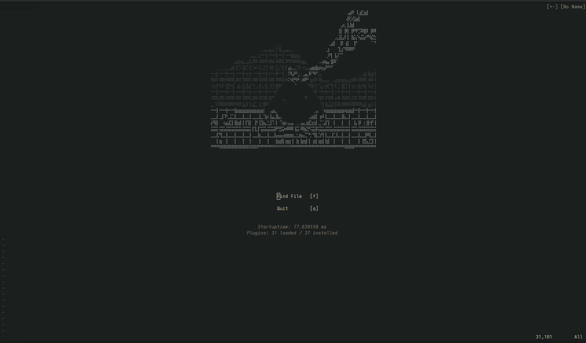

# milli.nvim

Animated ASCII splash screens for Neovim. 6 splashes come bundled, 30+ more are in a registry you can install from inside the editor, and there are live shaders (matrix rain, plasma, DOOM fire, starfield) computed in pure Lua with no frames on disk. The shaders also double as an idle screensaver. You can turn any image, GIF or piece of text into a splash with the milli CLI. Works with dashboard-nvim, alpha-nvim, snacks.nvim, mini.starter, or plain `VimEnter`.



## Contents

- [Bundled splashes](#bundled-splashes)
- [Install](#install)
- [Quick start](#quick-start)
- [Live shaders](#live-shaders)
- [Screensaver](#screensaver)
- [Community registry](#community-registry)
- [Using your own splash](#using-your-own-splash)
- [Dashboard integrations](#dashboard-integrations)
  - [dashboard-nvim](#dashboard-nvim)
  - [alpha-nvim](#alpha-nvim)
  - [snacks.nvim](#snacksnvim)
  - [mini.starter](#ministarter)
  - [No plugin (raw VimEnter)](#no-plugin-raw-vimenter)
- [Previewing](#previewing)
- [API](#api)
- [Requirements](#requirements)
- [License](#license)

## Bundled splashes

These six ship with the plugin, so the install stays small:

<table>
<tr>
<td align="center"><b>fire</b><br></td>
<td align="center"><b>blackhole</b><br></td>
<td align="center"><b>finger</b><br></td>
</tr>
<tr>
<td align="center"><b>dancerramp</b><br></td>
<td align="center"><b>skeleton</b><br></td>
<td align="center"><b>vibecat</b><br></td>
</tr>
</table>

`splash = "random"` picks a different one on every launch, from bundled plus whatever you have installed.

30+ more are in the [community registry](https://github.com/amansingh-afk/milli-splashes). One command, no plugin update:

```vim
:MilliBrowse            " list everything
:MilliInstall aurora    " download, validate, done
```

<table>
<tr>
<td align="center"><b>aurora</b><br></td>
<td align="center"><b>flyingdragon</b><br></td>
<td align="center"><b>catwoman</b><br></td>
</tr>
</table>

Full gallery: https://github.com/amansingh-afk/milli-splashes#gallery

## Install

lazy.nvim:
```lua
{ "amansingh-afk/milli.nvim", lazy = false }
```

packer.nvim:
```lua
use "amansingh-afk/milli.nvim"
```

## Quick start

```lua
-- preview any bundled splash in a scratch buffer
:MilliPreview fire

-- or wire it into your dashboard
require("milli").dashboard({ splash = "fire", loop = true })
```

List the splash names you have:
```lua
:lua print(vim.inspect(require("milli").list()))
```

Wiring for dashboard-nvim, alpha-nvim, snacks.nvim and mini.starter is under [Dashboard integrations](#dashboard-integrations).

## Live shaders

Splashes are flipbooks. Shaders are computed every frame in Lua. No data files, they never repeat, and they fill whatever size the window is.

```vim
:MilliShader rain       " fullscreen matrix rain
:MilliShader plasma     " flowing color fields
:MilliShader doomfire   " the classic PSX fire
:MilliShader starfield  " warp speed
```

`q` or `<Esc>` closes it. To drive one yourself:

```lua
-- paint a live shader into any buffer, returns a stop() function
local stop = require("milli").shader(buf, { shader = "rain" })

-- options
require("milli").shader(buf, {
  shader = "plasma",  -- rain | plasma | doomfire | starfield
  fps = 20,           -- default: per-shader (18-24)
  cols = 80,          -- default: window width
  rows = 24,          -- default: window height
  seed = 42,          -- rain/doomfire/starfield randomness
  hue = 0.8,          -- plasma base hue 0..1
})
```

Colors are quantized to a small fixed palette per shader so they stay well under Neovim's highlight-group cap.

## Screensaver

Leave Neovim idle for a few minutes and it fills the screen with a shader (or a looping splash). Press any key to come back. The key is swallowed, and your buffer, cursor, layout and mode are untouched.

```lua
require("milli").screensaver({ shader = "doomfire", after = 300 })
```

All options, defaults shown:

```lua
require("milli").screensaver({
  shader = "random",  -- doomfire | rain | plasma | starfield | "random" | { "rain", "plasma" }
  splash = nil,       -- loop a splash instead of a shader, e.g. "fire"
  after  = 300,       -- seconds idle
  fps    = nil,       -- shader fps override
  bg     = nil,       -- "#000000" for a black backdrop, nil keeps your Normal bg
})
require("milli").screensaver(false)  -- off
```

With lazy.nvim you can put it in `opts`:

```lua
{ "amansingh-afk/milli.nvim", lazy = false, opts = { screensaver = { after = 300 } } }
```

To see it without waiting:

```vim
:MilliScreensaver             " configured shader (random by default)
:MilliScreensaver doomfire    " a specific shader
:MilliScreensaver fire        " or any splash, centered and looping
:MilliScreensaver off         " disable the idle timer
```

Idle means no typed key. It stays out of the way while you are in the command line, in visual or terminal mode, or recording a macro. It rebuilds itself when the terminal is resized.

## Community registry

Install splashes shared by other people from inside Neovim. No plugin update, no copying files:

```vim
:MilliBrowse            " list what's in the registry
:MilliInstall doomfire  " download, validate, ready
:MilliPreview doomfire  " watch it
:MilliUninstall doomfire
```

Installed splashes go to `stdpath("data")/milli/splashes/` and behave exactly like bundled ones. Same `splash = "name"` API, same tab completion.

Safety: registry files must be pure data modules, the exact output of `milli export -t lua`. `:MilliInstall` loads each file in an empty Lua environment before saving it. Anything that calls a function, touches a global, or isn't plain frame data gets rejected.

Want your splash in the registry? PR it to [milli-splashes](https://github.com/amansingh-afk/milli-splashes). It's one `.milli` file plus a line in `index.json`. Needs `curl` on `$PATH`. Set `vim.g.milli_registry` to your own URL if you want a private registry.

## Using your own splash

This plugin is built on [milli](https://github.com/Amansingh-afk/milli), the ASCII engine that does the conversion. Star it if you find it useful.

Bring any image or GIF, a logo, a mascot, whatever, and it becomes a splash in four steps.

1. Install the CLI ([@amansingh-afk/milli](https://www.npmjs.com/package/@amansingh-afk/milli)):

```bash
npm install -g @amansingh-afk/milli
```

2. Generate `frames.lua` from an image, a GIF, or from nothing:

```bash
# from an image or GIF
milli export mycat.gif ./out -t lua -w 60 --no-bg

# from plain text: your name in flames, glitch, matrix reveal, 8 effects
milli text "NEOVIM" -e fire -o ./out -t lua
milli text "RICKY" -e matrix -o ./out -t lua

# from a shader, baked at a fixed size
milli shader plasma -w 70 -h 16 -o ./out -t lua
```

Useful flags:
- `-w 60`: width in columns, tune to taste
- `--no-bg`: drop the background color, cleaner on dashboards
- `-m braille`: braille mode, better for line art (image exports)
- `-e <effect>`: text effects: `fire` `glitch` `wave` `matrix` `dissolve` `typewriter` `pulse` `rainbow`

3. Copy `frames.lua` into your Neovim config:

```bash
mkdir -p ~/.config/nvim/lua/milli/splashes
cp out/frames.lua ~/.config/nvim/lua/milli/splashes/mycat.lua
```

Neovim picks up `~/.config/nvim/lua/` through runtimepath, so this file sits next to the bundled splashes. Same lookup, same tab completion in `:MilliPreview`.

4. Use it like any bundled splash:

```lua
require("milli").dashboard({ splash = "mycat", loop = true })
```

Preview it first:
```
:MilliPreview mycat
```

### Custom module path (advanced)

If you don't want to use the `milli.splashes` namespace (say you keep splashes under a dotfiles module), drop the file anywhere on runtimepath and point at it by module path:

```lua
-- ~/.config/nvim/lua/mydots/splashes/mycat.lua
require("milli").dashboard({ module = "mydots.splashes.mycat", loop = true })
```

Every preset takes either form: `splash = "name"` for bundled or user-local, `module = "path.to.mod"` for your own namespace.

## Dashboard integrations

Pick your dashboard plugin. Each preset (`dashboard`, `alpha`, `snacks`, `starter`, `vimenter`) works the same with bundled or custom splashes.

### dashboard-nvim

```lua
return {
  "nvimdev/dashboard-nvim",
  event = "VimEnter",
  dependencies = { "amansingh-afk/milli.nvim" },
  opts = function()
    local splash = require("milli").load({ splash = "finger" })
    return {
      theme = "doom",
      config = {
        header = splash.frames[1],         -- seed header with frame 0
        center = {
          { icon = "  ", desc = "Find File", key = "f", action = "Telescope find_files" },
          { icon = "  ", desc = "Quit",      key = "q", action = "qa" },
        },
      },
    }
  end,
  config = function(_, opts)
    require("dashboard").setup(opts)
    require("milli").dashboard({ splash = "finger", loop = true })
  end,
}
```

### alpha-nvim

```lua
require("milli").alpha({ splash = "fire", loop = true })
```

### snacks.nvim

```lua
return {
  "folke/snacks.nvim",
  priority = 1000,
  lazy = false,
  dependencies = { "amansingh-afk/milli.nvim" },
  opts = function()
    local splash = require("milli").load({ splash = "fire" })
    return {
      dashboard = {
        enabled = true,
        preset = {
          header = table.concat(splash.frames[1], "\n"),
        },
        sections = {
          { section = "header", padding = 1 },
          { section = "keys",   gap = 1, padding = 1 },
          { section = "startup" },
        },
      },
    }
  end,
  config = function(_, opts)
    require("snacks").setup(opts)
    require("milli").snacks({ splash = "fire", loop = true })
  end,
}
```

`preset.header` seeds frame 0 as the snacks header. milli finds that text in the buffer and animates over it, so the splash name in `preset.header` and in `require("milli").snacks({ splash = ... })` must match.

### mini.starter

```lua
require("milli").starter({ splash = "fire", loop = true })
```

### No plugin (raw VimEnter)

```lua
require("milli").vimenter({ splash = "fire", loop = true })
```

## Previewing

```
:MilliPreview <name>
```

Opens a scratch buffer and plays the splash in a loop. `q` or `<Esc>` closes it. Tab-completes bundled splashes, anything in `~/.config/nvim/lua/milli/splashes/`, and installed ones. `:MilliPreview` with no argument lists what you have.

## API

```lua
require("milli").play(buf, opts)       -- paint/animate into buf
require("milli").load(opts)            -- return the data table
require("milli").list()                -- all splash names (bundled + user + installed)
require("milli").shader(buf, opts)     -- live procedural shader, returns stop()
require("milli").shaders()             -- { "doomfire", "plasma", "rain", "starfield" }
require("milli").screensaver(opts)     -- idle screensaver, false to disable
require("milli").setup({ screensaver = opts })

require("milli").dashboard(opts)       -- autocmd preset for dashboard-nvim
require("milli").alpha(opts)           -- alpha-nvim
require("milli").snacks(opts)          -- snacks.nvim
require("milli").starter(opts)         -- mini.starter
require("milli").vimenter(opts)        -- raw VimEnter
```

### `opts`

```lua
{
  splash = "fire",     -- bundled, user-local or installed splash name, OR
  splash = "random",   -- a different one every Neovim start, OR
  splash = { "fire", "vibecat", "aurora" },  -- random from this list, OR
  module = "mysplash", -- require path to an external splash module, OR
  data = { ... },      -- the data table directly
  loop = true,         -- repeat forever (default: false, play once)
}
```

A plain string is short for `{ splash = <string> }`, so `require("milli").dashboard("fire")` works, and so does `require("milli").dashboard("random")`.

`"random"` is picked once per session. The header you seed with `load({ splash = "random" })` and the preset that animates it will always be the same splash.

## Requirements

- Neovim 0.10+ (extmarks, namespaces)
- `termguicolors` on (`vim.opt.termguicolors = true`)

## Why extmarks, not ANSI escapes?

Neovim buffers strip ANSI. Colors go through extmarks plus per-color highlight groups created on demand. Groups are keyed on quantized fg/bg so a truecolor splash doesn't blow through Neovim's highlight-group cap (E849).

## License

MIT.
